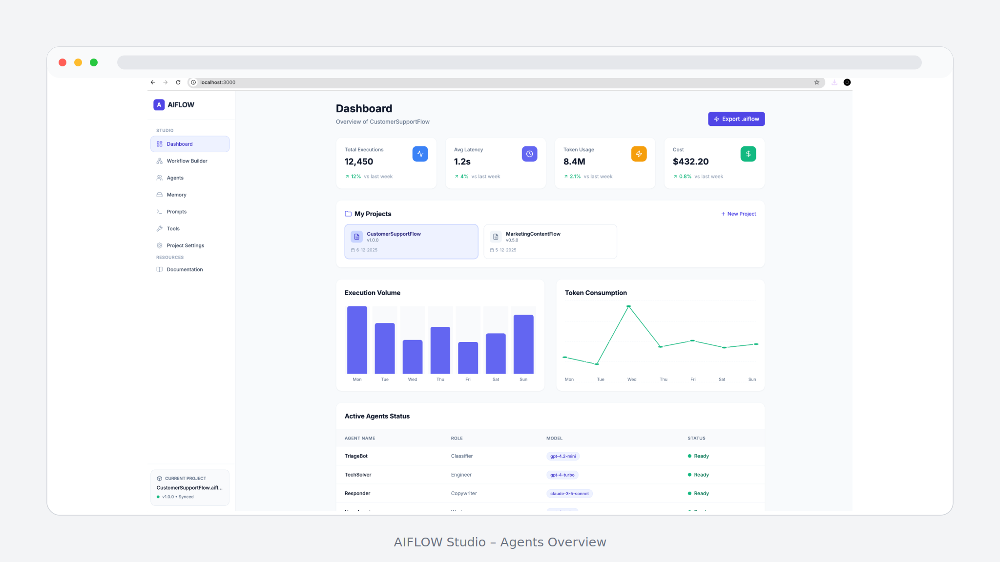
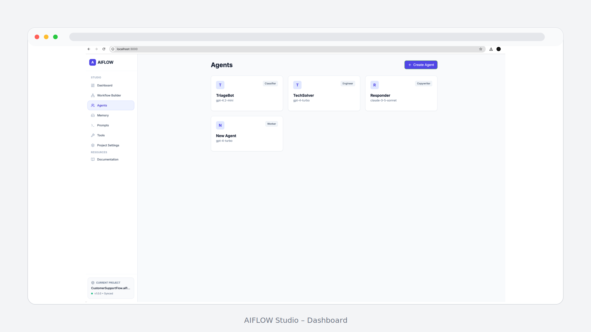
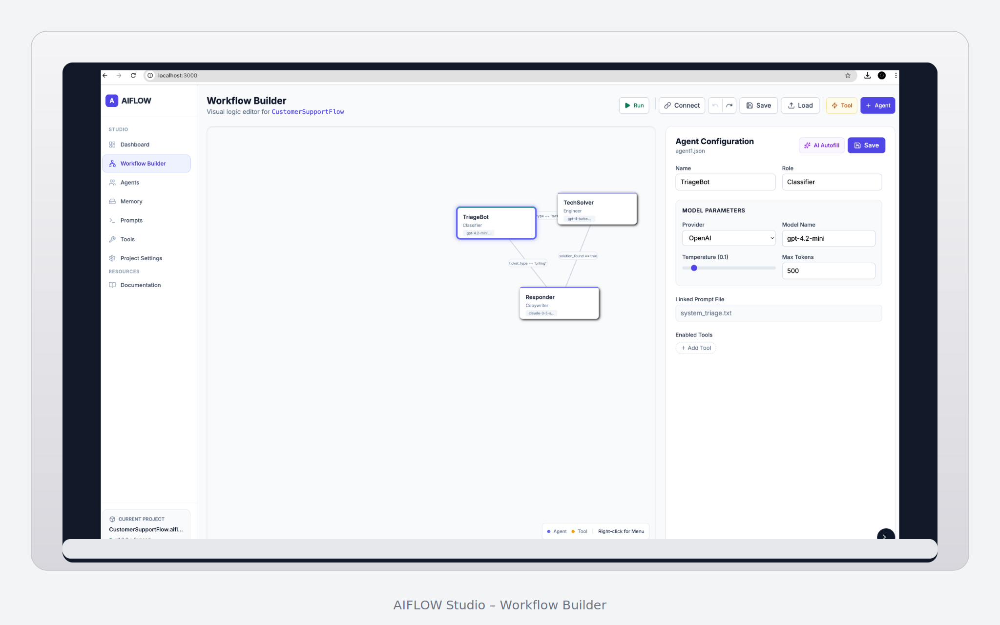

<div align="center">
  <h1>AIFLOW Studio</h1>

  <div>

  
  
  
  
  
  

  </div>

  <p><strong>Design, debug and execute multi-agent AI workflows – powered by the AIFLOW open standard.</strong></p>
</div>

---

## ⚡ Quick Start

```bash
git clone https://github.com/joetranga-wq/AIflow
cd AIflow

npm install
npm run dev
```

Open in browser:

```text
http://localhost:3000
```

Run a `.aiflow` workflow via CLI:

```bash
export API_KEY=YOUR_GEMINI_API_KEY
npm run run-flow -- ./examples/CustomerSupportFlow_v1.0.0.aiflow
```

---

## 🖼️ Screenshots

> Make sure these files exist under `docs/screenshots/` in your repo.

### Workflow Builder


### Agent Editor


### Execution Console


### Exporting `.aiflow`


---

## 🚀 What is AIFLOW?

AIFLOW is a universal standard for defining, sharing and executing **multi-agent AI workflows**.

It separates:

- **Workflow design** (AIFLOW Studio)  
- **Workflow execution** (AIFLOW Runtime)  
- **Workflow definition** (`.aiflow` specification)

AIFLOW aims to be:

- **Vendor-neutral** – works across providers (OpenAI, Gemini, Anthropic, etc.).  
- **Portable** – workflows live in a single `.aiflow` JSON file.  
- **Deterministic** – routing is driven by explicit logic rules.  

---

## 🧩 Core Concepts

Every AIFLOW project contains:

- `metadata`
- `flow` (agents, transitions, routing logic)
- `agents` (roles, prompts, models, config)
- `tools` (future extension)
- `memory` (future extension)

---

## 🧪 Running AIFLOW Studio (Browser Runtime)

### 1. Install dependencies

```bash
npm install
```

### 2. Create `.env.local`

```ini
GEMINI_API_KEY=YOUR_GEMINI_API_KEY
```

### 3. Start the dev server

```bash
npm run dev
```

### 4. Set global API key  

Go to **Settings → Global API Key** in the Studio UI.

### 5. Run a workflow  

Press **Run** in the UI to execute the current `.aiflow` project in the browser.

---

## 🖥️ Running `.aiflow` via CLI

Runtime entrypoint:

```text
runtime/cli/runAiflow.mts
```

Execute any `.aiflow` project:

```bash
export API_KEY=YOUR_GEMINI_API_KEY
npm run run-flow -- ./examples/CustomerSupportFlow_v1.0.0.aiflow
```

---

## 🧠 JSON Post-Processing

The runtime:

- strips ```json code fences  
- parses JSON output  
- injects parsed fields into the workflow context  

Example:

```json
"context": {
  "output_agent1": {
    "ticket_type": "general"
  }
}
```

Used for routing:

```json
"if": "output_agent1.ticket_type == 'billing'"
```

---

## 🧱 Project Structure

```text
AIflow/
├── studio/                 # React frontend (AIFLOW Studio)
│   ├── App.tsx
│   ├── components/
│   └── services/
│
├── core/                   # Shared logic & types
│   ├── types.ts
│   └── constants.ts
│
├── runtime/
│   ├── browser/            # Browser runtime
│   │   └── WorkflowRunner.ts
│   └── cli/                # CLI runtime
│       └── runAiflow.mts
│
├── docs/
│   └── screenshots/
│
├── spec/
│   └── aiflow-v0.1.md
│
├── examples/
│   ├── CustomerSupportFlow_v1.0.0.aiflow
│   ├── MarketingContentFlow_v0.5.0.aiflow
│   └── LeadQualificationFlow_v1.0.0.aiflow
│
├── index.tsx
├── index.html
├── vite.config.ts
├── package.json
└── tsconfig.json
```

---

## 🛣️ Roadmap

### v0.2  

- Conditional logic engine  
- Expression evaluator  

### v0.3  

- Tooling standard  
- Built-in tools  

### v0.4  

- Shared runtime  
- Python runtime  

### v1.0  

- Full `.aiflow` spec  
- Validation system  

---

## 🤝 Contributing

```bash
git checkout -b feat/my-feature
npm run dev
npm run run-flow -- ./examples/CustomerSupportFlow_v1.0.0.aiflow
git commit -am "Add feature"
git push
```

Please open a Pull Request with a clear description and, if possible, an example `.aiflow` file that demonstrates your change.

---

## 📜 License

MIT
